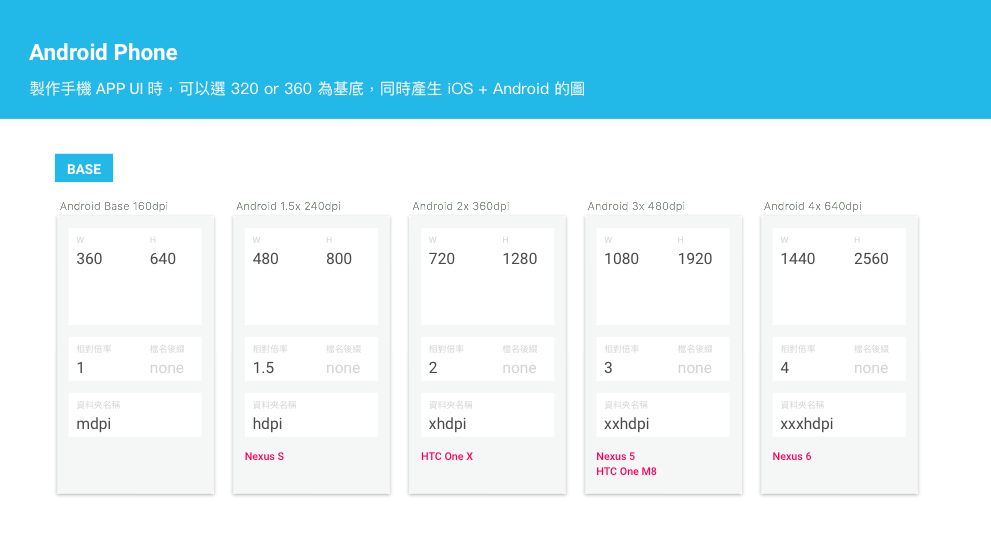
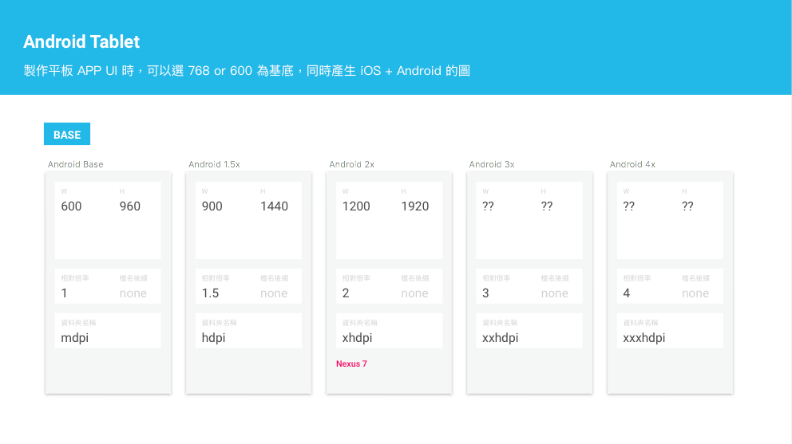
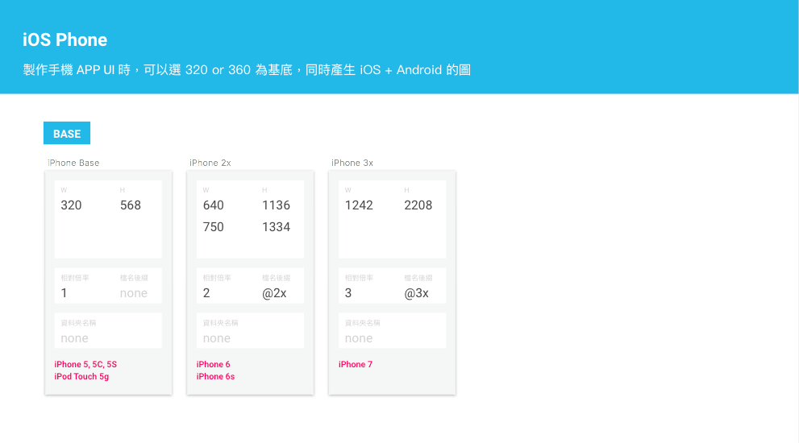
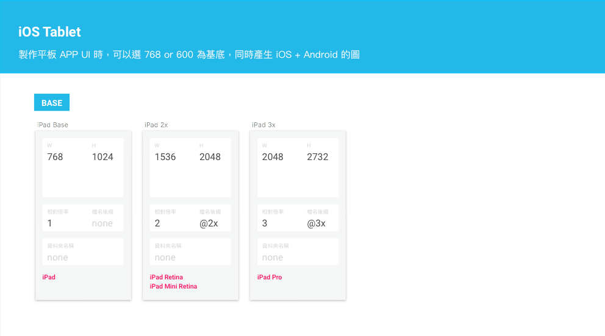
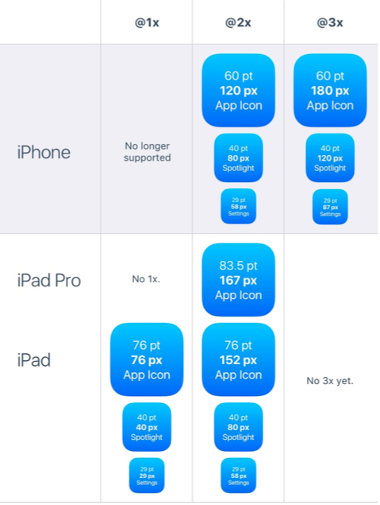
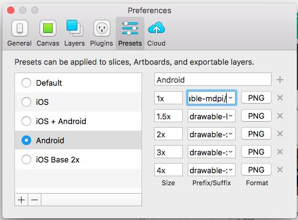
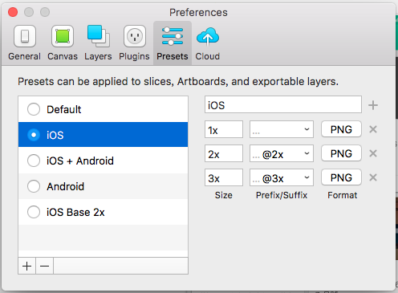
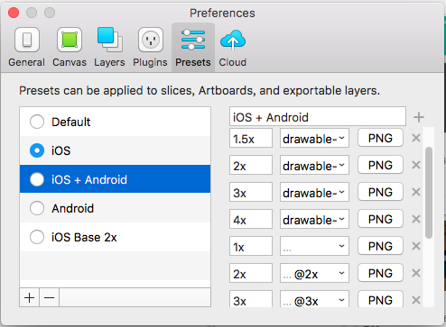

# Designer Support Guide

這篇是給製作APP UI 的 Designer 看的文章。  
將詳細說明怎麼同時設計 Android and iOS UI，及其需要注意的地方。

* iOS Design Guideline : [https://developer.apple.com/library/ios/documentation/UserExperience/Conceptual/MobileHIG/index.html\#//apple\_ref/doc/uid/TP40006556](https://developer.apple.com/library/ios/documentation/UserExperience/Conceptual/MobileHIG/index.html#//apple_ref/doc/uid/TP40006556)
* Android Design Guideline [http://developer.android.com/intl/zh-tw/design/index.html](http://developer.android.com/intl/zh-tw/design/index.html)

---

## 工具與交付

#### 設計
建議使用 Sketch 開發，因為它可以大量切圖，省去非常多功夫。而且他是全向量的。本章節所提供的懶人包也都會是 Skecth Format。

#### 溝通與標註
建議直接使用 Zeplin，工程師可以直接看上面物件的間距，色碼等資訊。

### 交付檔案

在你完成每個 APP UI 設計時，你應該提供以下檔案給工程師，**也需要特別注意在 iOS 跟 Android 上不同的畫面**。

* **Design File**：Sketch File，可以自己保留，不一定需要給工程師。
* **Flow**：APP 的 Flow Document 有幾種交付的方式
 - 使用 Zeplin 的 Section 功能分隔說明
 - 使用 Sketch 的 Artboard 框住所有的畫面，匯出一個 PDF
 - 可以用別的工具 EX: POP or Xmind，但因為通常 UI 會改很很多次，所以後來的更改通常都會懶得再更新到額外的工具。
* **Measurement**：UI 上的物件間隔資訊，可以直接在 Zeplin 觀看即可。
* **Resource Folder**：所有匯出的檔案
  * **Android**：Android UI assets，需再細分為五個解析度 folder。
  * **iOS**：iOS Assets，不用再細分 folder 檔名會有 @2x 跟沒有 @2x 的差異。
  * **launcher**：所有的 launcher icon 們。
  * **screenshot**：上架 APP 時所需的螢幕截圖，最好是 APP 主要功能的那幾個畫面。
  * **color define**：搭配 Zeplin 自動產生的即可。

---

## 懶人包

下載：[UIkit_Android_iOS.sketch](https://drive.google.com/file/d/0B4FiKSJ3us2LMVVoNzZTZElGZVU/view)

內容包含：
- Device Metrics：比較 Android & iOS Phone / Tablet 的倍率
- Android Phone & Tablet：mdpi(1x) 的模板
- iOS Phone & Tablet：1x 的模板
- Android & iOS Launchers：此模板可以讓你一鍵產生所有 Android & iOS Launchers 圖檔
- Android .9 Sample

---

## UI 設計尺寸

由於 Android 跟 iOS 螢幕解析度不一致，且 Device 種類太多，所以設計的時候，建議做一個可以放大的基本尺寸。

#### \[ Android Phone & Tablet \]

使用 `UIkit_Android_iOS.sketch` 中的 `Android Phone & Tablet` 可以省下很多工夫。




**這邊要特別注意，標給 Android 的 margin, padding... 等 Measurement 都必須是以 **`160dpi`** 為 1 倍單位。**

假設你是使用 `360 * 640` 做 UI，有一個 margin 是 10px 那你就要標 `10dp`，有一張圖片大小是 20px _ 20px 那就是 _`20dp`_，但你如果是用 \`720 _ 1280`做 UI 設計，有一個 margin 是 40px，那你就要把`40 / 2`也就是 20dp。依此類推，所以建議你使用 1 倍的`360 \* 640\` 做UI設計。

**問題：假設你拿到一個 Device 是 1200 \* 1920 而且是 320dpi，則你要做 UI 時一倍的螢幕 pixel 是多少呢？**

```
答案是 600 * 900px 為此一倍的大小。因為 320dpi 是 2倍，所以要除以二唷。
1200 / 2 = 600;
1920 / 2 = 960;
```

#### dp & px 轉換公式
```
px = dp * (dpi / 160)
``` 
依據此公式可以得知，如果 `dpi` 剛好為 160 的倍數，結果就會如上面的圖表，`1 dp = (1 or 2 or 3) px`。所以對於 `Nexus5, xxhdpi(480dpi), 1080*1920 px` 來說，一個 `width = 360dp` 的 View 會剛好等於螢幕寬<p>

但依據手機尺寸大小，可能會不一定剛好 `dpi = 160*X`。以 `Nexus 5X, 420dpi, 1080*1920 px`，如果你要畫一個螢幕寬的 View ，你需要設定 `width = 411dp`，也就是說，`Nexus5X` 雖然 pixel 數目跟 `Nexus5` 一樣，但是可以顯示的內容是比較多的

#### Configuration examples(Width DP 參考)
- 320dp: a typical phone screen (240x320 ldpi, 320x480 mdpi, 480x800 hdpi, etc).
- 480dp: a tweener tablet like the Streak (480x800 mdpi).
- 600dp: a 7” tablet (600x1024 mdpi).
- 720dp: a 10” tablet (720x1280 mdpi, 800x1280 mdpi, etc).

```
res/layout/main_activity.xml           # For handsets (smaller than 600dp available width)
res/layout-sw600dp/main_activity.xml   # For 7” tablets (600dp wide and bigger)
res/layout-sw720dp/main_activity.xml   # For 10” tablets (720dp wide and bigger)
```

參考網址：

* 凱西整理建議尺寸：[https://docs.google.com/spreadsheets/d/1b-qyqvTmatyC6gCy71QuKbXE-Wqj\_oxjM5wHfT3Q72M/edit\#gid=0](https://docs.google.com/spreadsheets/d/1b-qyqvTmatyC6gCy71QuKbXE-Wqj_oxjM5wHfT3Q72M/edit#gid=0) \(內部 Only\)
* [https://design.google.com/devices/](https://design.google.com/devices/)
* [http://iconhandbook.co.uk/reference/chart/android/](http://iconhandbook.co.uk/reference/chart/android/)
* Google 建議UI 間距：[https://www.google.com/design/spec/layout/metrics-keylines.html\#metrics-keylines-keylines-spacing](https://www.google.com/design/spec/layout/metrics-keylines.html#metrics-keylines-keylines-spacing)
* 教你認識 DPI : [http://sebastien-gabriel.com/designers-guide-to-dpi/](http://sebastien-gabriel.com/designers-guide-to-dpi/)

#### \[ iOS Phone & Tablet \]

使用 `UIkit_Android_iOS.sketch` 中的 `iOS Phone & Tablet` 可以省下很多工夫。




* 參考：[http://iosres.com/](http://iosres.com/)
* 參考：[https://developer.apple.com/library/ios/documentation/UserExperience/Conceptual/MobileHIG/IconMatrix.html](https://developer.apple.com/library/ios/documentation/UserExperience/Conceptual/MobileHIG/IconMatrix.html)

## Launcher Icon 尺寸

要跨雙系統需要非常多不同尺寸的launcher icon，詳列如下。使用 `UIkit_Android_iOS.sketch` 中的 `Android & iOS Launchers` 可以省下很多工夫。

#### \[ Android \]

| 檔名 | 尺寸 |
| --- | --- |
| GooglePlay.png | 512 \* 512 |
| GooglePlayMarket.png | 1024 \* 500 |
| ic\_launcher-mdpi.png | 48 \* 48 |
| ic\_launcher-hdpi.png | 72 \* 72 |
| ic\_launcher-xhdpi.png | 96 \* 96 |
| ic\_launcher-xxhdpi.png | 144 \* 144 |
| ic\_launcher-xxxhdpi.png | 192 \* 192 |
| mdpi/icon\_notify\_large.png | 64 \* 64 |
| hdpi/icon\_notify\_large.png | 96 \* 96 |
| xhdpi/icon\_notify\_large.png | 128 \* 128 |
| xxhdpi/icon\_notify\_large.png | 192 \* 192 |
| xxxhdpi/icon\_notify\_large.png | 256 \* 256 |
| mdpi/icon\_notify\_small-mdpi.png | 24 \* 24 |
| hdpi/icon\_notify\_small.png | 36 \* 36 |
| xhdpi/icon\_notify\_small.png | 48 \* 48 |
| xxhdpi/icon\_notify\_small.png | 72 \* 72 |
| xxxhdpi/icon\_notify\_small.png | 96 \* 96 |

#### \[ iOS \]



| 檔名 | 尺寸 |
| --- | --- |
| AppleStore.png | 1024 \* 1024 |
| icon\_20.png | 20 \* 20 |
| icon\_20@2x.png | 40 \* 40 |
| icon\_29.png | 29 \* 29 |
| icon\_29@2x.png | 58 \* 58 |
| icon\_29@3x.png | 87 \* 87 |
| icon\_40.png | 40 \* 40 |
| icon\_40@2x.png | 80 \* 80 |
| icon\_60.png | 60 \* 60 |
| icon\_60@2x.png | 120 \* 120 |
| icon\_60@3x.png | 180 \* 180 |
| icon\_76.png | 76 \* 76 |
| icon\_76@2x.png | 152 \* 152 |
| icon\_83\_5@2x.png | 167 \* 167 |

* 參考：[iOS App Icon Sizes](https://developer.apple.com/ios/human-interface-guidelines/graphics/app-icon/)

---

## 檔名 Rule

Android 跟 iOS 檔名請都不要用 `-` DASH，請用 `_` 底線。副檔名請都使用 `.png` 格式，僅有 Android 有 `.9.png` 格式。常見的檔名如下：

* icon\_btn\_back.png： `icon_btn` 代表可以點擊的按鈕們。
* icon\_indicator\_calendar.png： `icon_indicator` 代表一些清單上的小 icon。
* icon\_notify\_small.png： `icon_notify` 是推播的 icon。
* login\_btn\_bg.9.png： `.9.png` 的圖是可以延展的。
* sprout\_logo\_begin.png：其他的圖，就可以隨著客戶隨便命名。

---

## Sketch 匯出

基本上只要每個 slice 都有設定好匯出應該會蠻順利的。唯一需要注意的是， `Android 的 Resource` 必須放到不同 Resolution 名稱的 folder 裡。

此時可以透過 sketch 的 export prefix 或是 suffix 做不同的設定：

#### \[ Android \]

使用 Prefix 設定資料夾名稱

 

#### \[ iOS \]

使用 Suffix 設定檔名後綴

 

#### \[ Android & iOS \]

當然你也可以同一個 slice 同時匯出雙系統資源



---

## 色碼教學

Android 跟 iOS 使用的色碼方式不同：

|  | 舉例紅色 | 舉例 30% 透明的紅色 |
| --- | --- | --- |
| Android | \#FF0000 | \#4D0000 |
| iOS | \[UIColor colorWithRed:238.0f/255.0f green:204.0f/255.0f blue:204.0f/255.0f alpha:1.0\] | \[UIColor colorWithRed:238.0f/255.0f green:204.0f/255.0f blue:204.0f/255.0f alpha:0.3\] |

* iOS 的 color Generator : [http://www.briangrinstead.com/blog/ios-uicolor-picker](http://www.briangrinstead.com/blog/ios-uicolor-picker)

\[Android\] 的透明度色碼表：

| 透明度 | 代碼 | 透明度 | 代碼 |
| --- | --- | --- | --- |
| 100% | FF | 95% | F2 |
| 90% | E6 | 85% | D9 |
| 80% | CC | 75% | BF |
| 70% | B3 | 65% | A6 |
| 60% | 99 | 55% | 8C |
| 50% | 80 | 45% | 73 |
| 40% | 66 | 35% | 59 |
| 30% | 4D | 25% | 40 |
| 20% | 33 | 15% | 26 |
| 10% | 1A | 5% | 0D |
| 0% | 00 | -- | -- |

---

## 網路上收集到的 Ui Kit

* [看這邊 內部專屬唷](https://drive.google.com/drive/folders/0B4FiKSJ3us2LY1JxbWZWTkxHeXM)
