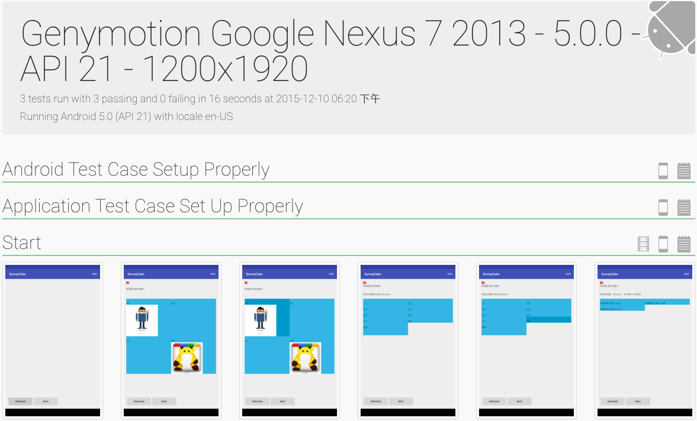

# Espresso + Spoon

`Espresso` 是 **Google** 開發的 `Auto Testing` 套件，其用途是可以讓我們自動化的跑定義好的 **Use Case**。`Spoon`則是 **Square** 開發的 `Testing 輔助套件`，除了可以幫助我們在跑 `Auto Testing` 的時候**截圖**，還可以產生 **html 的report文件**，方便我們檢視，另外 `Spoon` 也支援一次跑在**多個 Device**

## 使用 Espresso
阿旺已經為我們寫好了介紹。請直接跳轉喔:
- [Blog 介紹文](http://blog.25sprout.com/2015/10/hello-android%EF%BC%81%E4%BE%86%E6%9D%AF-espresso-%E5%90%A7%EF%BC%81/)
- [Github Sample](https://github.com/awonwon/EspressoTestSample)

##使用 Spoon

- import spoon-client。可以從[官網](http://square.github.io/spoon/)下載 `spoon-client.jar`，或是使用 `MAVEN`：
``` xml
<dependency>
  <groupId>com.squareup.spoon</groupId>
  <artifactId>spoon-client</artifactId>
  <version>1.2.1</version>
</dependency>
```

- 配合Espresso 的使用。在 Test Class 中，在想截圖的地方，呼叫 `Spoon.screenshot()`
``` java
@RunWith(AndroidJUnit4.class) // run test runner，並使用 JUnit 4
public class UseCaseTest {
    ...
    @Test
    public void start() throws Exception {
        onView(withId(R.id.fragment_text_edit))
            .perform(typeText(message), closeSoftKeyboard());
        
        Spoon.screenshot(activity, "fill EditText");
        
        onView(withId(R.id.activity_quiz_button_next))
            .perform(click());
        
        Spoon.screenshot(mActivityRule.getActivity(), "click next");
    }
    ...
}
```

- Build Project，產生 `app.apk` & `app-androidTest.apk`
- 從[官網](http://square.github.io/spoon/)下載 `spoon-runner.jar` 檔，並且利用command line執行
``` 
 java -jar spoon-runner.jar --apk <path_to_apk>/app-debug.apk --test-apk <path_to_test_apk>/app-androidTest.apk --sdk <path_to_android_sdk>
```

- 執行成功，就會產生 **spoon-output folder**，裏頭有所有 Print Screet 的結果，index.html( report 網站)，以及其他的相關資訊
 


## 提醒
1. 在 run **spoon-runner** 前，可以先用 `$ adb devices` 確認所有連接的 devices。**spoon-runner** 會一次跑完所有的 device
2. 有人有開發 [Spoon Gradle Plugin](https://github.com/stanfy/spoon-gradle-plugin)，可以省去以上複雜步驟。設定完之後，只需要 `$ ./gradlew spoon`。但是我測試之後，一直失敗XDDD，待有心人嘗試看看囉~

##Reference
- [Espresso](https://google.github.io/android-testing-support-library/docs/espresso/index.html)
- [Spoon](http://square.github.io/spoon/)
- [Spoon for testing multiple Android devices and result reporting](http://www.emalis.com/2014/01/spoon-for-testing-multiple-android-devices-and-result-reporting-awesome/)